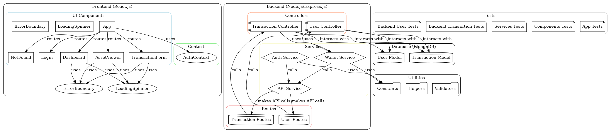

# AR3D-Core Architecture Overview

## Introduction

The AR3D-Core application is designed with a modular architecture that separates concerns between the frontend and backend components. This document provides an overview of the system architecture, including the technologies used, the interaction between components, and the overall design principles.

## Architecture Diagram

## Components

### 1. Frontend

- **Framework**: The frontend is built using React.js, allowing for a dynamic and responsive user interface.
- **State Management**: Redux is used for state management, ensuring a predictable state container for the application.
- **3D Visualization**: Three.js is utilized for rendering 3D assets in the augmented reality environment.
- **Styling**: CSS and styled-components are used for styling the application, providing a modern and clean user interface.

### 2. Backend

- **Framework**: The backend is built using Node.js and Express.js, providing a robust server-side environment.
- **Database**: MongoDB is used as the database to store user data, transaction history, and asset information.
- **Authentication**: JSON Web Tokens (JWT) are used for secure user authentication and authorization.
- **API**: RESTful API endpoints are created to facilitate communication between the frontend and backend.

## Data Flow

1. **User  Interaction**: Users interact with the frontend application, which sends requests to the backend API.
2. **API Requests**: The backend processes these requests, interacts with the database, and returns the appropriate responses.
3. **Data Rendering**: The frontend receives the data and updates the user interface accordingly, including rendering 3D assets in AR.

## Conclusion

The modular architecture of AR3D-Core allows for easy maintenance, scalability, and the ability to integrate new features in the future. This design ensures a seamless user experience while managing digital assets in an augmented reality environment.
